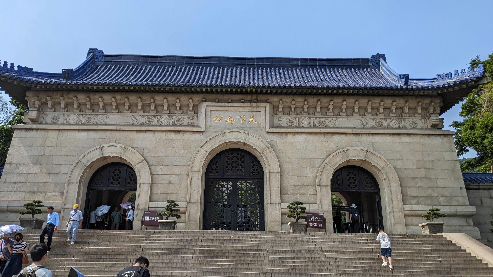

# 南京之旅

一直想去拜谒中山陵,感念于孙中山先生一生起伏转折,读他的<<建国方略>>收获很多.

## day1

汉口站到南京南站,差不多三小时.南京真的是一座很优雅的城市,地铁是人文地铁.定下规划,要去中山陵和南京博物院.

## 南京博物院

看了反清复明系列作品,八大山人,明官员肖像......

## 晋谒中山陵

{align = left}想到很多.

下午去了东南大学牌楼校区,可惜没有细看.

## 遗憾

因为学校这边活动,没来得及祭拜明孝陵,中山先生当年率文武官员明孝陵(许多人都在质疑,为什么推翻了封建君主专制之后,孙中山还要去祭奠一个封建君主.1912年2月12日,清帝退位后,孙中山于13日发出《辞临时大总统文》和《推荐袁世凯文》,并于15日举行“民国统一大典”.此次拜谒活动是大典的一项重要内容,之后以孙中山先生的名义发表了两个文告《祭明太祖文》和《谒明太祖陵文》.前一篇为“祝告文”,后一篇是“宣读文”.《祭明太祖文》中写道：“赵宋末造,代于蒙古,神州陆沉,几及百年……满清乘间入据中夏,嗟我帮人诸夫兄弟,迭起迭碚,至于二百六十有八年.”孙中山把元、清两代当成是中国亡国的年代,此次谒陵是在告诫世人,汉人重新掌权,恢复中华,就像当年朱元璋消灭元朝建立明朝一样.https://dfz.nanjing.gov.cn/gzdt/202110/t20211012_3155528.html)

